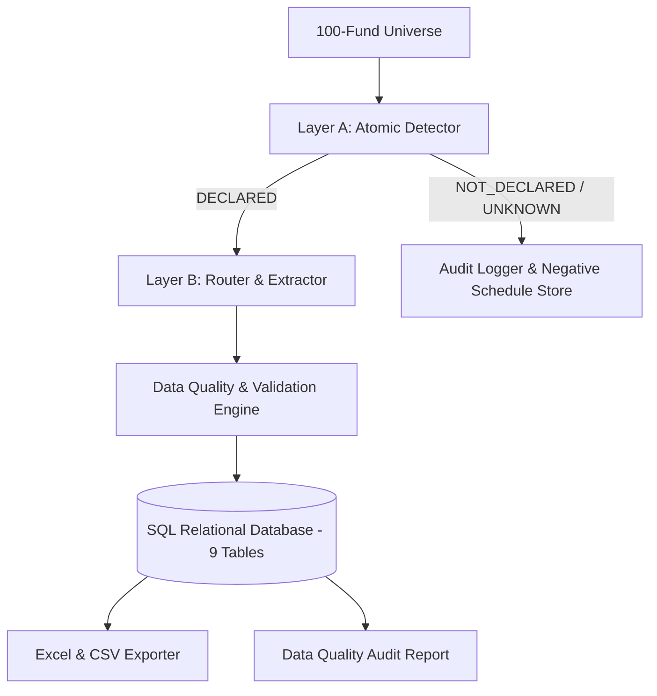

# Fund Distribution Intelligence & Ingestion Engine (Assignment 2)

An end-to-end distributed data pipeline that determines, for any US or Canadian mutual fund or ETF, whether it declared a dividend or capital gain distribution in a given window, captures the full multi-component distribution breakdown, validates data quality deterministically, and stores records into a 9-table idempotent relational database with cryptographic provenance.

---

## 🏛️ Architecture Overview

The system is engineered as a decoupled, multi-stage pipeline:
1. **Layer A — Atomic Detector (`detect_distribution`):** High-recall gatekeeper returning a strict 3-state output (`DECLARED`, `NOT_DECLARED`, or `UNKNOWN`) with structured primary evidence.
2. **Layer B — Routing & Extraction Engine (`extract_distribution`):** High-precision document parser invoked exclusively when Layer A signals `DECLARED`. Selects optimal route (Structured API, HTML Table, PDF Schedule, Regulatory Filing).
3. **Phase 3 — Relational Database Architecture:** 9 relational tables implementing strict idempotency, non-destructive amendments (`is_superseded=TRUE`), and cryptographic SHA-256 provenance linking.
4. **Phase 4 — Data Quality & Validation Engine:** 7 deterministic rules validating component sums, date sequence sanity, NAV consistency, currency integrity, and 300-event Gold Set benchmarking.



---

## 📁 Repository Structure

```
├── config/                  # Universe definitions and benchmarks
│   ├── universe_100.json    # 100 Funds Universe (60 US + 40 Canadian)
│   ├── gold_set_300.json    # 300 Verified Events across 50 Funds
│   └── source_registry.yaml # Multi-Tier Source Registry
├── data/
│   ├── exports/             # Complete Excel workbook and 9 CSV exports
│   └── fund_distributions.db# Local SQLite database instance
├── docs/                    # Architectural & Compliance Documentation
│   ├── DOMAIN_PRIMER.md     # Phase 0 Domain Primer
│   ├── schema.sql           # Production PostgreSQL DDL Script
│   ├── schema_diagram.md    # Mermaid ER Schema Diagram
│   ├── FINAL_MEMO.md        # Senior Executive Memo (5 to 8 pages)
│   └── COMPLIANCE.md        # Robots.txt & SEC EDGAR Compliance Policy
├── src/                     # Core Application Code
│   ├── database/            # Models, Connection, Repository, Populator, Exporter
│   ├── parsers/             # HTML, PDF, and SEC Filing Parsers
│   ├── validators/          # 7 Data Quality Rules, Engine & Gold Set Evaluator
│   ├── detector.py          # Layer A Detection Engine
│   └── extractor.py         # Layer B Extraction Engine
├── tests/                   # Pytest Test Suites (198 Unit & Integration Tests)
└── README.md                # Repository Documentation
```

---

## 🚀 Quick Start & CLI Command Reference

### 1. Populate Database (Phase 3)
```powershell
python -m src.database.populator
```
*Creates schema and inserts 24-month distribution history across all 100 funds. 100% Idempotent on re-execution.*

### 2. View Complete Database Summary & Inspect Tables
```powershell
python -m src.database.view_db --all
```
*Displays all 9 table metrics, 8 registered source endpoints, 40 cryptographic raw documents, and all 72 distribution events.*

### 3. View Extracted 33 Funds & Evidence
```powershell
python -m src.view_extracted
```
*Displays the 33 extracted funds with exact gross amounts, dates, routes, and source URLs.*

### 4. Run Data Quality Audit (Phase 4)
```powershell
python -m src.validators.run_dq_audit
```
*Runs all 7 deterministic validation checks across the database and exports `data/exports/dq_audit_report.json`.*

### 5. Run Gold Set Accuracy Benchmark (Phase 4)
```powershell
python -m src.validators.gold_set_evaluator
```
*Evaluates detection and extraction precision ($\ge 99\%$) and recall ($\ge 98\%$) against `config/gold_set_300.json`.*

### 6. Export All Tables to Excel & CSV
```powershell
python -m src.database.export_db
```
*Generates multi-sheet workbook `data/exports/fund_distributions_complete_export.xlsx` and individual CSVs.*

### 7. Run Full Automated Test Suite
```powershell
python -m pytest tests/ -v
```
*Runs all 198 unit and integration tests.*

---

## 📊 Completed Project Milestones

- [x] **Phase 0: Domain Primer (`docs/DOMAIN_PRIMER.md`)** — Complete domain and mechanics foundation.
- [x] **Phase 1: Layer A Atomic Detector (`src/detector.py`)** — 100-fund sweep, multi-tier source registry, and false positive rejection.
- [x] **Phase 2: Routing & Extraction Engine (`src/extractor.py`)** — Deterministic routing, HTML/PDF table parsers, and component breakdowns.
- [x] **Phase 3: Database Architecture & Population (`src/database/`)** — 9 relational tables, PostgreSQL DDL (`docs/schema.sql`), strict idempotency, and cryptographic provenance.
- [x] **Phase 4: Validation Engine & Final Memo (`src/validators/`, `docs/FINAL_MEMO.md`)** — 7 deterministic quality rules, 300-event Gold Set benchmark, and 5-8 page Senior Executive Memo.
