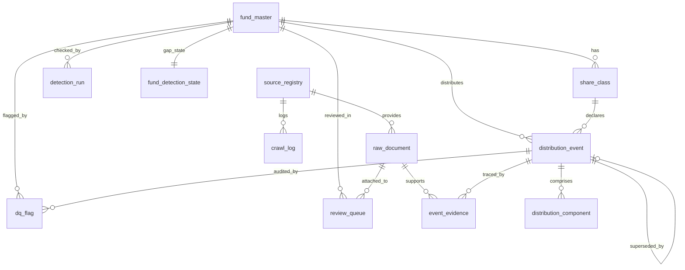

# Database schema (Phase 3)

Generated DDL: `docs/schema.sql`. ORM: `src/database/models.py`. Default engine is SQLite
(`data/fund_distributions.db`); set `DATABASE_URL` for PostgreSQL.

## Tables from the PDF

| Table | Purpose | Notes |
|---|---|---|
| `fund_master` | Fund: name, family, CIK / SEDAR id, country, type, inception, status | |
| `share_class` | Ticker, CUSIP, ISIN, series/class id, FundServ code, currency, expected frequency | `currency` is what the currency check compares against |
| `source_registry` | Every source: URL pattern, tier, parser version, robots/ToS status, last success | ToS status stays `PENDING_REVIEW` until recorded in `docs/COMPLIANCE.md` |
| `crawl_log` | Every HTTP attempt: source, time, HTTP status, sha256, outcome, duration | written for every request, including failures and robots.txt refusals |
| `raw_document` | Immutable copy of every artefact: exact bytes on disk (`storage_path`), sha256, retrieval time | identical bytes stored once |
| `distribution_event` | One row per class x ex-date x category x estimated/final (+ version) | see key below |
| `distribution_component` | Component type, amount per share, % | only components the source published; `components_reported` on the event says whether a split exists |
| `event_evidence` | Links an event to the raw documents that support it | `reported_amount` keeps each source's own figure |
| `dq_flag` | Validation failures, severity, resolution status | idempotent: an identical open flag is never inserted twice |

## Refinements and why

1. **Natural key adds `distribution_category`.** `(class_id, ex_date, distribution_category, estimated_or_final, version)`.
   A December income dividend and a long-term capital gain paid on the same ex-date are two
   distributions. Keyed on ex-date only, the second superseded the first.
2. **`version` + `is_superseded` / `superseded_by`.** A restatement by the source that stated the
   current figure (new amount or new component split, e.g. a T3 reallocation) appends version
   N+1; the old row is only marked superseded, so what we believed and when stays intact.
3. **Cross-source disagreement is not an amendment.** If a *different* source reports another
   amount, the event is left as is, the second figure is stored in `event_evidence.reported_amount`
   and a `CROSS_SOURCE_VARIANCE` flag is raised (PDF: "record both and flag, never silently pick one").
4. **`detection_run` (added).** One row per Layer A check: status, confidence, UNKNOWN reason,
   suggested route, route actually taken, evidence JSON, HTTP requests, bytes, seconds. This is
   where "route logged for 100% of detected events", hit rate and cost per check come from.
5. **`fund_detection_state` (added).** `expected_frequency`, `last_confirmed_event_date`,
   `last_checked_at`, `consecutive_unknowns` - the exact fields the PDF's backfill and gap logic needs.
6. **`review_queue` (added).** Figures that fail a CRITICAL check, MANUAL-route detections and
   figures without a stored source document. They never reach `distribution_event`.
7. **Wider ids.** `event_id` is `evt_{class}_{ex_date}_{category}_{est|final}_v{n}` (up to 160 chars),
   readable and deterministic, so re-runs address the same row.
