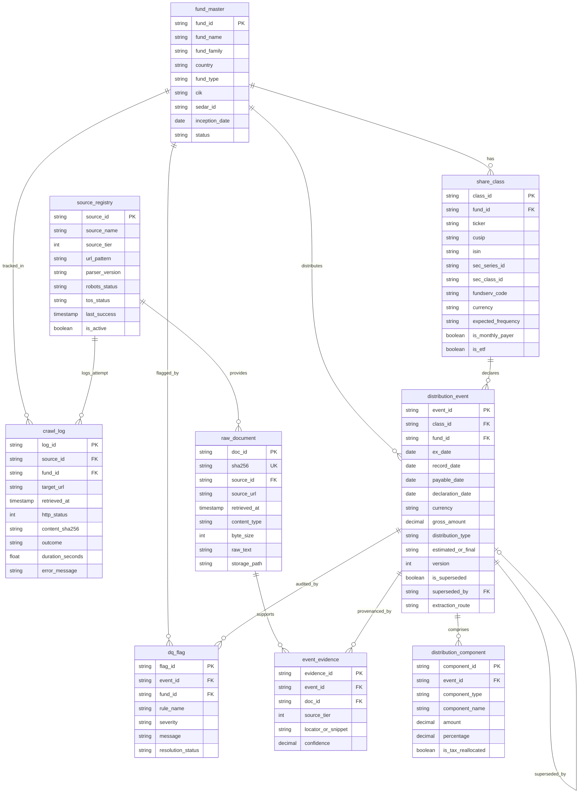

# Relational Database Schema Diagram (Phase 3)

Entity-Relationship architecture for the Fund Distribution Extraction Database.

---

## 🔑 Natural Keys & Constraints Defense

1. **`distribution_event` Natural Key:**
   * Constraint: `UNIQUE(class_id, ex_date, estimated_or_final, version)`
   * **Defense:** Guarantees idempotency. Re-running the pipeline on the same date will not create duplicate rows for the same share class and ex-date.
2. **Amendments & Versioning:**
   * When a Canadian year-end T3/T5 reallocation or US estimated-to-final change occurs, the new record is inserted with `version = N + 1`, and the previous record is marked `is_superseded = TRUE` with `superseded_by = new_event_id`.
   * **Defense:** Never deletes or overwrites historic audit records.
3. **Provenance Integrity:**
   * `event_evidence` strictly maps `event_id -> doc_id`, ensuring every number in the database has a cryptographic raw document trail (`sha256`).
